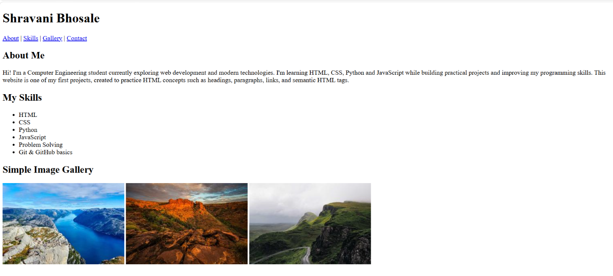
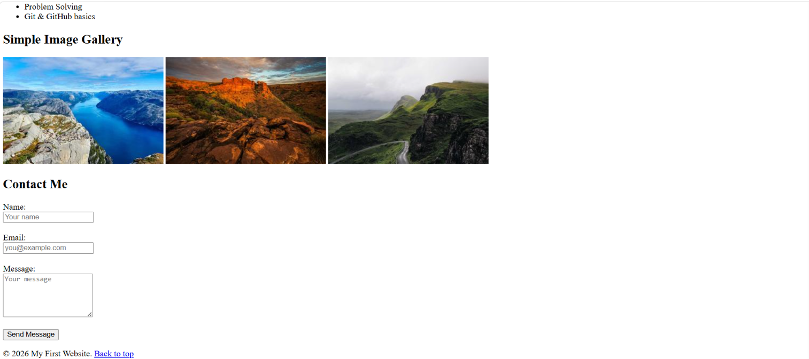
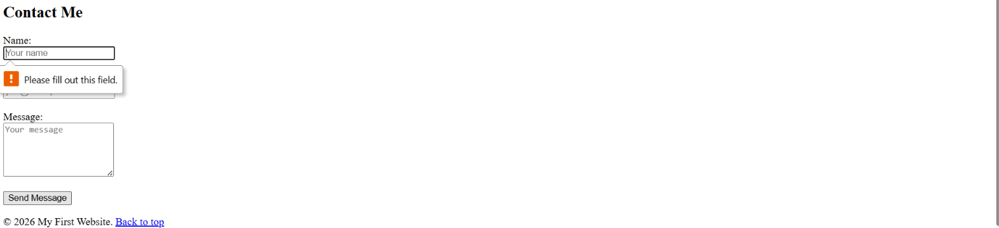

# My First Website — Week 1 HTML Project

## Project Overview
This is my first web development project, built as part of Week 1 of the
internship program. The goal was to learn and apply core HTML concepts by
building a simple personal portfolio-style page from scratch, without any
CSS or JavaScript.

## HTML Concepts Learned
- **Document structure**: `<!DOCTYPE html>`, `<html>`, `<head>`, and `<body>`
- **Headings and paragraphs**: `<h1>`, `<h2>`, `<p>` for structuring content
- **Semantic HTML**: `<header>`, `<nav>`, `<main>`, `<section>`, `<footer>`
  used instead of generic `<div>`s, to give the page meaningful structure
- **Attributes**: `id`, `class`, `href`, and `src` used to identify elements,
  style hooks, and link/reference resources
- **Links**: internal anchor links (`href="#section-id"`) for in-page
  navigation, and the `<a>` tag in general
- **Images**: the `` tag with `src` and descriptive `alt` text, grouped
  into a simple gallery
- **Lists**: `<ul>` and `<li>` used to display a list of skills
- **Forms**: `<form>`, `<label>`, `<input>`, and `<textarea>`, along with
  basic HTML5 validation attributes (`required`, `minlength`, `maxlength`,
  `type="email"`)

## Portfolio Structure
The page is organized into four main sections, all reachable from the
navigation menu in the header:

1. **About** — a short introduction about myself
2. **Skills** — a bullet-point list of skills I'm currently building
3. **Gallery** — a simple image gallery
4. **Contact** — a contact form with basic input validation

A "Back to top" link in the footer returns to the header.

## File Structure
```
project-folder/
├── index.html
├── README.md
├── images/
│   ├── image1.jpg
│   ├── image2.jpg
│   └── image3.jpg
└── screenshots/
    ├── homepage.png
    ├── gallery-contact.png
    └── form-validation.png
```

## How to Run
1. Download/clone this folder.
2. Open `index.html` directly in a browser, **or**
3. Open the folder in VS Code and use the "Live Server" extension for a live preview while editing.

## Visual Documentation

**Homepage — header, navigation, About, and Skills sections:**



**Gallery and Contact form:**



**Form validation in action:**



## Testing
Since this is a static HTML page (no backend logic), testing was done manually:

- Verified the page loads correctly in the browser via Live Server
- Clicked every navigation link (About, Skills, Gallery, Contact) to confirm
  each one scrolls to the correct section
- Tested the contact form's HTML5 validation:
  - Submitting with empty fields shows the browser's "Please fill out this
    field" warning
  - Entering an invalid email format is rejected
  - Message field enforces a 10–500 character length
- Confirmed all three gallery images load correctly
- Checked the HTML structure using the [W3C Markup Validator](https://validator.w3.org/)
  to confirm no syntax errors

## Notes
- No CSS or JavaScript is used for the core structure — this project
  intentionally focuses on HTML fundamentals only, per the Week 1 task
  requirements.
- A small `<style>` block is included to size the gallery images, since
  uncontrolled image dimensions made the gallery unusable.
- The images used in the gallery are stored locally in the `images/` folder.
