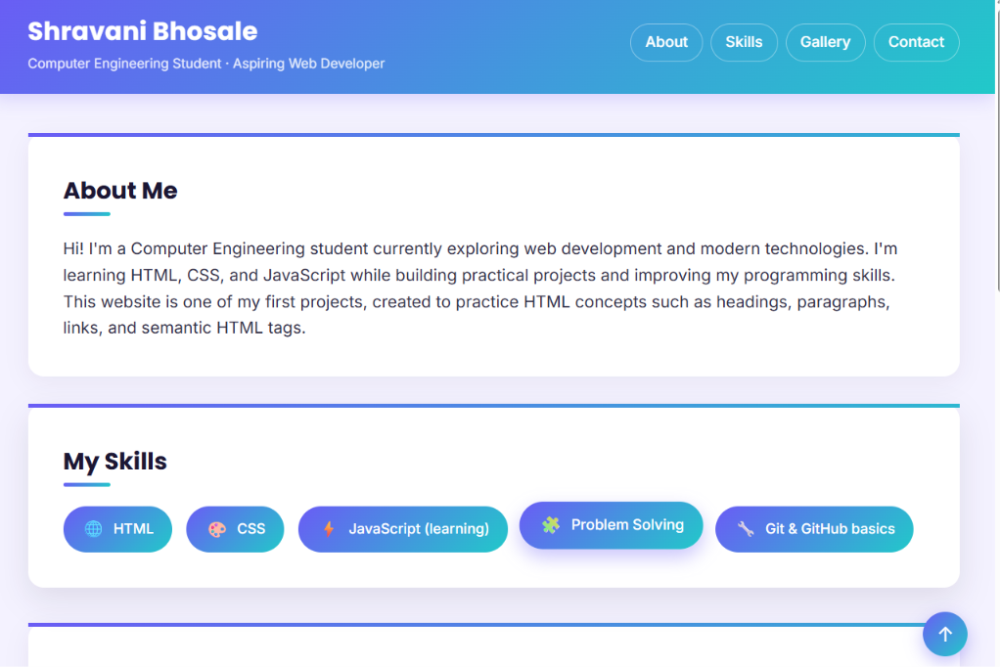
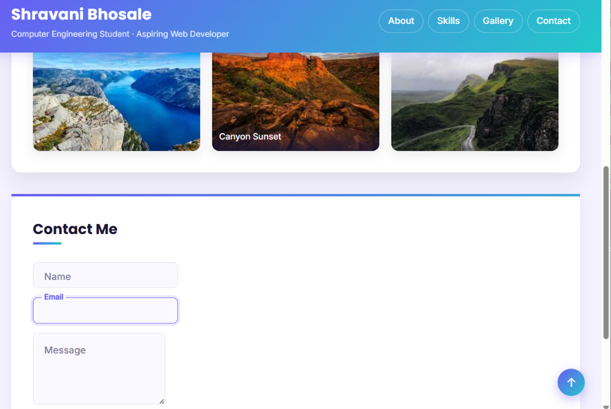
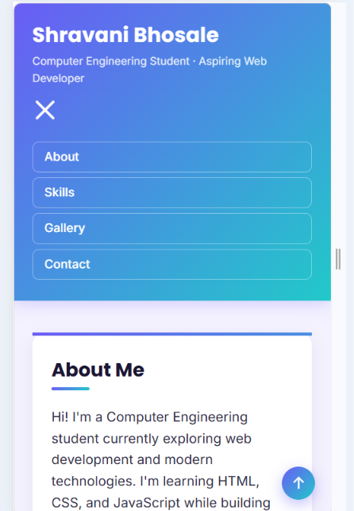

# My First Website — Styled Portfolio Project

## Project Overview
This is a personal portfolio website built as part of a web development
internship. The site is a single-page portfolio with four sections — About,
Skills, Gallery, and Contact — reachable through a sticky navigation
header, styled with a gradient theme, custom fonts, Flexbox/Grid layouts,
hover effects, a mobile hamburger menu, and animated floating form labels,
all done in pure CSS with no JavaScript.

---

## CSS Concepts Used

**Selectors**
- **Element selectors** — e.g. `nav a`, `h1`, `h2` for baseline styling
- **Class selectors** — e.g. `.section`, `.btn`, `.skills-list` for reusable
  styling hooks
- **ID selectors** — e.g. `#about p` for one-off targeting
- **Pseudo-class selectors** — `:hover`, `:focus`, `:active`,
  `:checked`, `:not(:placeholder-shown)` for interactive states
- **Pseudo-element selectors** — `::before`, `::after` for decorative
  accents (the button shine-sweep effect and the gradient underline
  beneath section headings)
- **Combinators** — the general sibling selector (`~`) to link the
  hamburger checkbox and floating labels to elements that aren't their
  direct parent

**Layout**
- **Flexbox** — used for the header (logo + nav), the skills badge list,
  and the contact form's vertical stacking
- **CSS Grid** — used for the 3-column image gallery, which collapses to
  a single column on mobile
- **CSS variables (custom properties)** — `--gradient`, `--dark`,
  `--accent`, etc. defined in `:root` for a consistent, easily-adjustable
  color scheme throughout the site

**Box model & positioning**
- `padding`, `margin`, and `border-radius` used throughout for card-style
  sections and rounded buttons/badges
- `position: sticky` on the header so navigation stays visible while
  scrolling
- `position: fixed` on the floating "back to top" button
- `position: absolute` combined with a relative parent for the gallery
  hover captions and the floating form labels

**Interactivity (pure CSS, no JavaScript)**
- **Mobile hamburger menu** — built using the "checkbox hack": a hidden
  `<input type="checkbox">` paired with a `<label>` styled as a hamburger
  icon. The `:checked` pseudo-class combined with the general sibling
  selector (`~`) toggles the nav menu open/closed and animates the icon
  into an X, entirely without JavaScript.
- **Floating form labels** — labels sit inside the input by default and
  animate upward when the field is focused or filled, using
  `:focus` and `:not(:placeholder-shown)` (with `placeholder=" "` as the
  trigger for the latter).
- **Hover-reveal gallery captions** — each gallery image is wrapped in a
  `<figure>`; the caption is positioned absolutely and slides up into
  view via `transform: translateY()` on `:hover`.
- **Button shine sweep** — a `::before` pseudo-element sweeps a light
  gradient across the button on hover using a `transition` on `left`.
- Smooth `transition`s are used throughout (badges lifting on hover,
  cards lifting on hover, nav links glowing on hover) rather than
  instant state changes, to make the site feel more polished.

## Design Decisions
- **Color scheme**: a purple-to-teal gradient (`#6a5cf5 → #21c9c9`) was
  chosen as the primary brand identity, used consistently across the
  header, buttons, skill badges, and section accents, so the whole page
  feels cohesive rather than using isolated colors per section.
- **Typography**: Google Fonts "Poppins" (bold, geometric) for headings
  and "Inter" (clean, readable) for body text — a common pairing that
  keeps headings distinct from paragraph text.
- **Card-based layout**: each section is a rounded white card with a
  subtle shadow and a gradient top border, which visually separates
  content blocks and creates a sense of depth against the light
  lavender page background.
- **Micro-interactions**: hover lifts, glows, and the button shine sweep
  were added so the page feels responsive to user interaction, not
  static — this was intentionally kept to CSS only, to stay within the
  Week 2 HTML/CSS-only scope.

## Responsiveness Approach
The layout is built mobile-first-friendly using a single breakpoint at
`600px` via `@media (max-width: 600px)`:
- The header switches from a horizontal nav bar to a collapsible
  hamburger menu
- The 3-column image gallery collapses to a single column
- Section padding and margins shrink slightly to save space
- The submit button stretches to full width for easier tapping
- The floating back-to-top button shrinks slightly

This was tested using the browser's built-in device toolbar (Chrome
DevTools → Toggle device toolbar) across several simulated phone widths,
as well as by manually resizing the browser window.

---

## Portfolio Structure
The page is organized into four main sections, all reachable from the
navigation menu in the header:

1. **About** — a short introduction about myself
2. **Skills** — a list of skills, shown as icon badges
3. **Gallery** — an image gallery with hover-reveal captions
4. **Contact** — a contact form with floating labels and input validation

A floating "back to top" button and a footer link both return to the top
of the page.

## File Structure
```
project-folder/
├── index.html
├── style.css
├── README.md
├── images/
│   ├── image1.jpg
│   ├── image2.jpg
│   └── image3.jpg
└── screenshots/
    ├── desktop-about-skills.png
    ├── desktop-gallery-contact.png
    └── mobile-nav-menu.png
```

## Setup Instructions
1. Download or clone this folder.
2. Open `index.html` directly in a browser, **or**
3. Open the folder in VS Code and use the "Live Server" extension for a
   live preview while editing.

No build tools, package managers, or dependencies are required — this is
a static HTML/CSS site. `style.css` is linked from `index.html` via a
`<link>` tag, and fonts are loaded from Google Fonts over a CDN link.

---

## Visual Documentation

**Desktop — About and Skills sections:**



**Desktop — Gallery hover caption and floating form labels:**



**Mobile — Hamburger menu open:**



## Testing
Testing was done manually in the browser, since this is a static
front-end project with no backend logic:

- Verified the page loads correctly via Live Server
- Clicked every navigation link (About, Skills, Gallery, Contact) to
  confirm each one scrolls to the correct section
- Tested the contact form's HTML5 validation: empty fields, invalid
  email format, and message length limits all correctly trigger
  browser warnings
- Tested the floating labels by focusing, typing into, and clearing each
  field to confirm the label animates up/down correctly
- Tested the hamburger menu on mobile width: opened and closed it
  multiple times, confirmed the icon animates into an X and back
- Resized the browser window across several widths (and used Chrome
  DevTools device toolbar) to confirm the layout adapts smoothly with no
  overlapping or cut-off content
- Hovered over all interactive elements (nav links, skill badges,
  gallery images, the submit button) to confirm hover states and
  transitions work as intended
- Checked the HTML structure using the [W3C Markup Validator](https://validator.w3.org/)
  to confirm no syntax errors

## Notes
- This project intentionally uses CSS only (no JavaScript) — all
  interactivity (hamburger menu, floating labels, hover effects) is
  achieved with pure CSS techniques such as the checkbox hack and
  `:focus`/`:not()` pseudo-classes.
- The images used in the gallery are stored locally in the `images/`
  folder.
