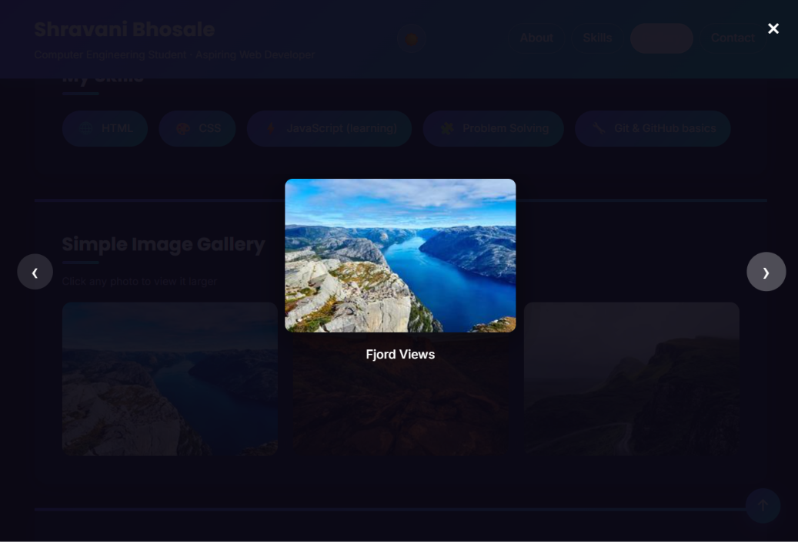
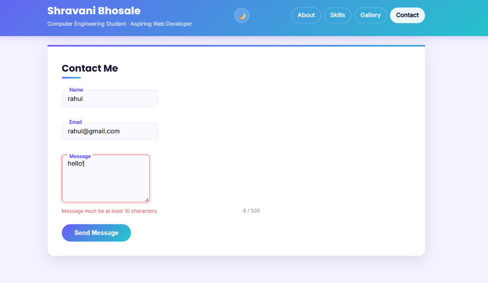

# My First Website — Interactive Portfolio Project

## Project Overview
This is a personal portfolio website built as part of a web development
internship. The site is a single-page portfolio with four sections — About,
Skills, Gallery, and Contact — made interactive with vanilla JavaScript:
a dark/light mode toggle, a clickable image lightbox, real-time form
validation with error messages, a live character counter, scroll-based nav
highlighting, and scroll-reveal animations — all without any external
libraries or frameworks.

---

## JavaScript Features Implemented

**1. Dark / Light Mode Toggle**
A button in the header toggles a `dark-mode` class on `<body>`, switching
the site's color scheme. The chosen theme is saved to `localStorage`, so it
persists across page reloads — on load, the script checks for a saved
preference and applies it immediately.

**2. Image Gallery Lightbox**
Clicking any gallery photo opens a full-screen lightbox showing that image
enlarged, with Previous/Next buttons to cycle through the gallery, a close
button, and support for closing by clicking outside the image or pressing
`Escape`. Arrow keys (`←` `→`) also navigate between images.

**3. Real-Time Contact Form Validation**
The contact form's Name, Email, and Message fields are validated with
JavaScript rather than relying only on the browser's default validation:
- Each field is checked as the user types (`input` event) and when they
  leave the field (`blur` event)
- A red error message appears beneath the exact field that's invalid,
  explaining what's wrong (e.g. "Please enter a valid email address")
- On submit, all three fields are re-validated; if everything passes, the
  form resets and a success message appears for a few seconds

**4. Live Character Counter**
The Message field shows a live "x / 500" counter that updates on every
keystroke, and turns red once the user is close to the character limit.

**5. Active Nav Link Highlighting**
As the user scrolls, an `IntersectionObserver` detects which section is
currently in view and highlights the matching navigation link, so it's
always clear which part of the page you're looking at.

**6. Scroll-Reveal Animations**
Each section fades and slides into view the first time it scrolls into the
viewport, using a second `IntersectionObserver` instance. Once a section
has animated in, it stops being observed (so it doesn't repeat).

**7. Scroll-Aware Back-to-Top Button**
A floating button stays hidden until the user scrolls down more than
300px, then fades in — implemented with a `scroll` event listener.

---

## Form Validation Logic (in detail)
Validation is handled by three dedicated functions — `validateName()`,
`validateEmail()`, and `validateMessage()` — each of which:
1. Reads and trims the current field value
2. Checks it against the relevant rule(s):
   - **Name**: required, minimum 2 characters
   - **Email**: required, must match a basic email pattern
     (`text@text.text`) via a regular expression
   - **Message**: required, minimum 10 characters
3. Calls a shared `setFieldError()` helper to either display an error
   message and mark the field red, or clear the error if the value is
   now valid

These functions are called both on every keystroke/blur (for instant
feedback) and again on form submit — the submit handler uses
`event.preventDefault()` to stop the page from reloading, checks all three
fields together, and only shows the success message if every field passes.

---

## Design Decisions
- **Native browser popups avoided**: the form uses `novalidate` so the
  browser's default validation tooltips don't fire, letting the custom
  JavaScript-driven error messages take over entirely for a more
  consistent look and better control over messaging.
- **Reusable, named functions**: rather than writing one large block of
  logic, each feature (theme toggle, lightbox, validation, counter, nav
  highlighting, reveal animation) is broken into small reusable functions
  with clear responsibilities, making the code easier to read and test.
- **`IntersectionObserver` over scroll math**: nav highlighting and
  scroll-reveal both use `IntersectionObserver` instead of manually
  calculating element positions on every scroll event, which is more
  efficient and considered current best practice.
- **Persisted preferences**: dark mode uses `localStorage` so a returning
  visitor's preference is remembered, rather than resetting on every page
  load.

## Interactive Elements Summary
| Element | Trigger | Feedback |
|---|---|---|
| Theme toggle button | `click` | Instantly switches colors site-wide; persists on reload |
| Gallery photos | `click` | Opens lightbox with that image |
| Lightbox prev/next | `click` / arrow keys | Cycles through gallery images |
| Lightbox close | `click` (button, overlay, or `Escape`) | Closes the lightbox |
| Form fields | `input` / `blur` | Shows/clears validation error instantly |
| Form submit | `submit` | Validates all fields, shows success message |
| Message field | `input` | Updates live character counter |
| Page scroll | `scroll` | Highlights current nav link, reveals sections, shows/hides back-to-top button |

---

## Portfolio Structure
The page is organized into four main sections, all reachable from the
navigation menu in the header:

1. **About** — a short introduction about myself
2. **Skills** — a list of skills, shown as icon badges
3. **Gallery** — an image gallery with a clickable lightbox
4. **Contact** — a contact form with real-time validation

## File Structure
```
project-folder/
├── index.html
├── style.css
├── script.js
├── README.md
├── images/
│   ├── image1.jpg
│   ├── image2.jpg
│   └── image3.jpg
└── screenshots/
    ├── dark-mode-nav.png
    ├── gallery-lightbox.png
    └── form-validation-counter.png
```

## Setup Instructions
1. Download or clone this folder.
2. Open `index.html` directly in a browser, **or**
3. Open the folder in VS Code and use the "Live Server" extension for a
   live preview while editing.

No build tools, package managers, or external JavaScript libraries are
required — `script.js` is plain vanilla JavaScript, linked at the bottom
of `index.html` via a `<script>` tag.

---

## Visual Documentation

**Dark mode with active nav link highlighting:**


**Gallery lightbox open:**



**Form validation with live character counter:**



## Testing
Testing was done manually in the browser, since this is a static
front-end project with no backend server:

- Toggled dark/light mode repeatedly and refreshed the page to confirm
  the preference persists via `localStorage`
- Opened the lightbox from each of the three gallery images, and tested
  the Previous/Next buttons, the close (×) button, clicking outside the
  image, the `Escape` key, and the `←`/`→` arrow keys
- Tested form validation by:
  - Submitting the form completely empty
  - Entering an invalid email (missing `@`, missing domain)
  - Entering a name shorter than 2 characters
  - Entering a message shorter than 10 characters
  - Filling in all fields correctly and confirming the success message
    appears and the form resets
- Watched the character counter update in real time while typing, and
  confirmed it turns red near the 500-character limit
- Scrolled the full page slowly and confirmed the correct nav link
  highlights at each section, and that each section fades in only once
- Scrolled past 300px and back to confirm the back-to-top button fades
  in/out correctly, and that clicking it smoothly scrolls to the top
- Checked the HTML structure using the [W3C Markup Validator](https://validator.w3.org/)
  to confirm no syntax errors

## Notes
- All interactivity is implemented in vanilla JavaScript with no external
  libraries or frameworks.
- The images used in the gallery are stored locally in the `images/`
  folder.
